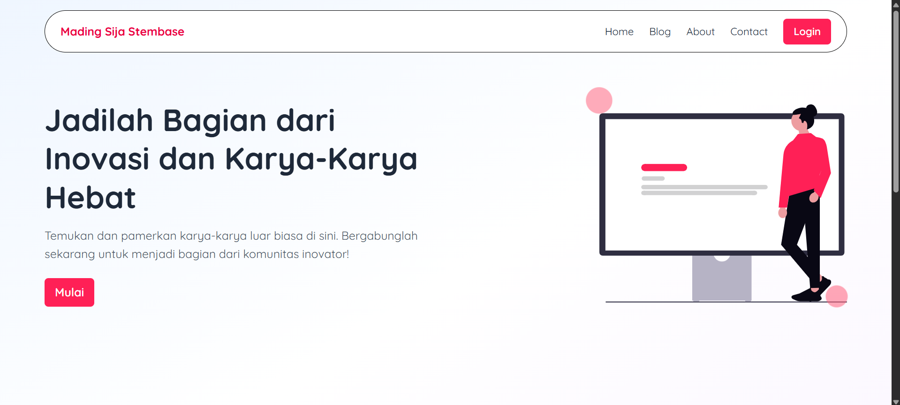

# 📰 MadingsijaStemba

**MadingsijaStemba** adalah platform mading digital interaktif untuk SMK Negeri 7 Semarang, dirancang untuk menyatukan ide, kreativitas, dan informasi dari siswa, oleh siswa, untuk seluruh warga sekolah.



---

## 📌 Fitur Utama

🔹 **User Biasa**
- Memberikan komentar pada artikel
- Membaca konten mading digital
- Memberikan like pada artikel

🔹 **Writer**
- CRUD (Create, Read, Update, Delete) artikel (wip)

🔹 **Admin**
- Kelola seluruh pengguna dan artikel
- Pantau statistik dan aktivitas platform
- Moderasi komentar

---

## 🛠️ Teknologi yang Digunakan

| Frontend | Backend | Database | Tools |
|----------|---------|----------|-------|
| ReactJS  | PHP (REST API) | MySQL / MariaDB | Postman, VSCode, GitHub |

---

## ⚙️ Struktur Backend API

```bash
.
|-- ./.htaccess
|-- ./articles.php
|-- ./auth
|   |-- ./auth/login.php
|   `-- ./auth/register.php
|-- ./categories.php
|-- ./comments.php
|-- ./composer.json
|-- ./composer.lock
|-- ./config
|   `-- ./config/db.php
|-- ./db.sql
|-- ./stats.php
|-- ./uploads
|-- ./users.php
|-- ./utils
|   `-- ./utils/auth.php
`-- ./vendor
```

## 🚀 Cara Menjalankan Proyek

1. **Clone repositori**
```sh
git clone https://github.com/AhdanFirdaus/madingsijastemba.git
cd madingsijastemba
```

2. **Jalankan Backend (PHP)**

3. **Jalankan Frontend (React)**
```sh
npm install
npm run dev
```

4. **Akses halaman**
```sh
http://localhost:5173/
```

## 🙏 Terima Kasih